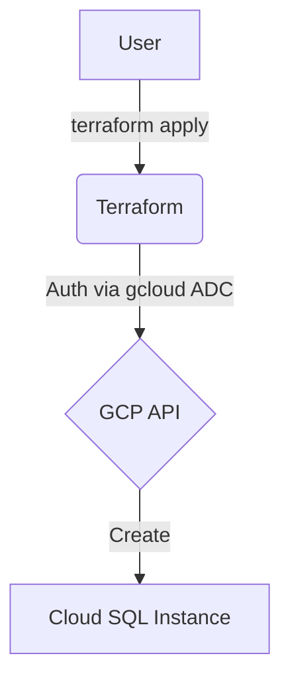
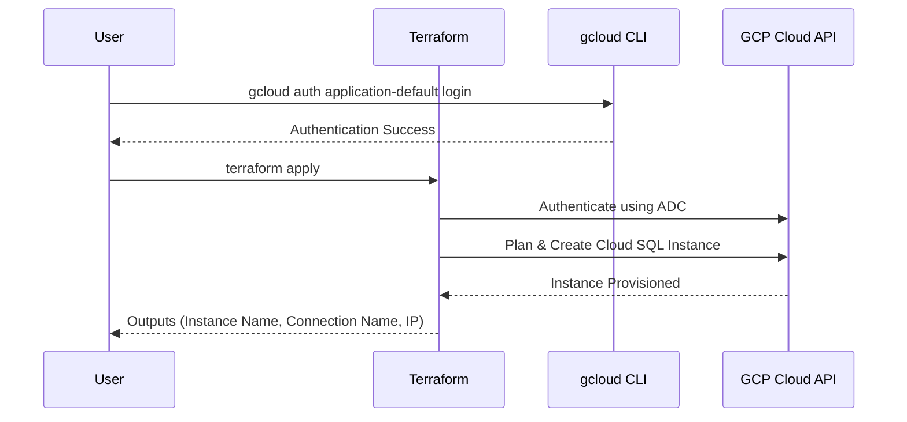

# terraform-gcp-cloud-sql

This Terraform project provisions a Google Cloud SQL instance.

## Architecture

### Flowchart


### Sequence Diagram


## Cloud SQL Specifications
- **Database Engine**: `MYSQL_8_0`, `POSTGRES_14`, or `POSTGRES_15`.
- **Region**: Restricted to `us-west1`, `us-central1`, or `us-east1` (GCP Always Free Tier regions).
- **Machine Type**: `db-f1-micro` (free tier eligible) or `db-g1-small`.
- **Storage**: Starts at 10 GB.
- **High Availability**: Disabled by default for free tier.
- **Backup**: Enabled by default.

## GCP Free Tier Limits (Always Free)
To stay within the free tier, ensure your usage does not exceed:
- **Instance**: 1 Cloud SQL instance (MySQL or PostgreSQL) using db-f1-micro machine type.
- **Storage**: 10 GB of storage per month.
- **Network**: 1 GB of outgoing network traffic per month.

## Prerequisites
1.  **Google Cloud SDK**: [Installed and initialized](https://cloud.google.com/sdk/docs/install).
2.  **Terraform**: [Installed](https://developer.hashicorp.com/terraform/downloads).

## Setup & Deployment

1.  **Authenticate and Select Project**:
    Instead of using a service account JSON file, this project uses your local `gcloud` credentials.
    ```bash
    # Authenticate
    gcloud auth application-default login

    # Select your project
    gcloud config set project your-project-id
    ```

2.  **Configure Variables**:
    Create a `terraform.tfvars` file based on the example:
    ```hcl
    project_id     = "your-project-id"
    region         = "us-central1"
    instance_name  = "my-cloud-sql-instance"
    database_name  = "mydb"
    database_user  = "user"
    ```

3.  **Deploy**:
    ```bash
    # Initialize
    terraform init
    
    # Apply changes
    terraform apply
    ```

4.  **Outputs**:
    After a successful deployment, Terraform will output the instance details.

## Usage as a Module

Reference this repository as a Terraform module in your own configurations:

> **Option 1**: Terraform Registry (recommended)
> ```hcl
> module "cloud-sql" {
>   source  = "marcuwynu23/cloud-sql/gcp"
>   version = "1.0.0"
>
>   project_id     = var.project_id
>   region         = "us-central1"
>   instance_name  = "my-app-sql"
>   database_name  = "appdb"
>   database_user  = "appuser"
> }
> ```
>
> **Option 2**: GitHub source
> ```hcl
> module "cloud-sql" {
>   source = "github.com/marcuwynu23/terraform-gcp-cloud-sql?ref=main"
>
>   project_id     = var.project_id
>   region         = "us-central1"
>   instance_name  = "my-app-sql"
>   database_name  = "appdb"
>   database_user  = "appuser"
> }
> ```

Then use the outputs in your configuration:

```hcl
# Example: pass the connection name to a Cloud Run service
resource "google_cloud_run_v2_service" "app" {
  # ...
  template {
    containers {
      env {
        name  = "DB_CONNECTION_NAME"
        value = module.cloud_sql.connection_name
      }
      env {
        name  = "DB_NAME"
        value = module.cloud_sql.database_name
      }
      env {
        name  = "DB_USER"
        value = module.cloud_sql.database_user
      }
    }
  }
}
```

## Variables

| Variable | Description | Type | Default |
|----------|-------------|------|---------|
| `project_id` | GCP project ID | `string` | (required) |
| `region` | GCP region (free tier: us-west1, us-central1, us-east1) | `string` | `"us-central1"` |
| `instance_name` | Cloud SQL instance name | `string` | (required) |
| `database_name` | Name of the initial database | `string` | (required) |
| `database_user` | Name of the initial database user | `string` | (required) |
| `database_version` | Database engine version | `string` | `"MYSQL_8_0"` |
| `tier` | Machine type | `string` | `"db-f1-micro"` |

## Outputs

| Output | Description |
|--------|-------------|
| `instance_name` | Name of the created Cloud SQL instance |
| `connection_name` | Connection name of the Cloud SQL instance |
| `public_ip_address` | Public IP address of the instance |
| `database_name` | Name of the initial database |
| `database_user` | Name of the initial database user |
